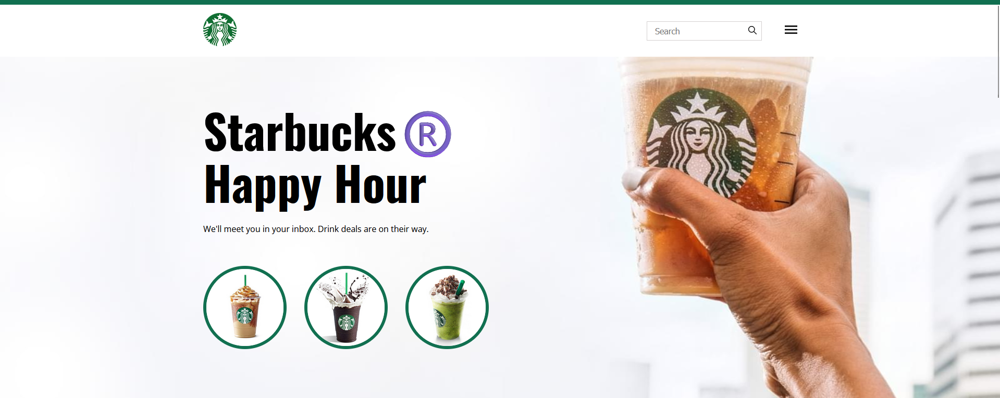
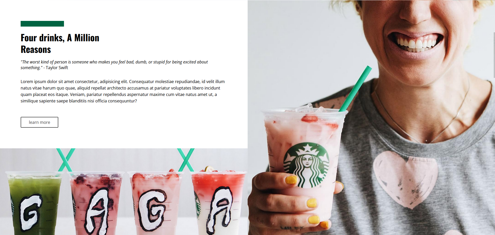
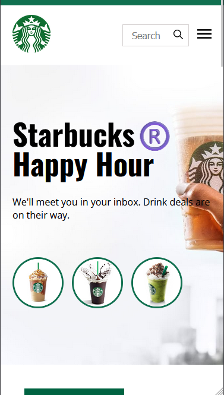
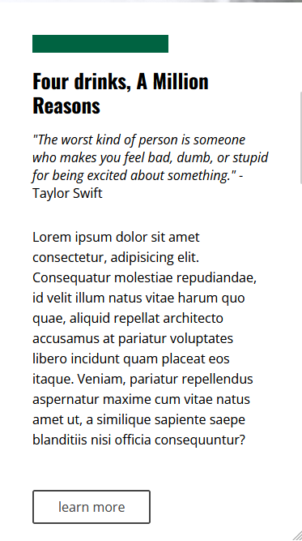

# ☕ Starbucks Landing Page ☕

Este projeto é uma LP com tema do Starbucks, para aprimorar o conhecimento em **HTML** e **CSS**.

## 💻 Tecnologias Utilizadas 💻

- **HTML5**: Utilizado para a estruturação do conteúdo da página.
- **CSS3**: Utilizado para a estilização da página, incluindo o uso de fontes do Google Fonts e media queries para responsividade.

## Estrutura do Projeto

```
starbuckslp/
│
├──assets
│   ├─css
│   └────images
├──index.html
└──README.md
```

## Capturas de Tela 💻 e 📱

### Desktop





### Mobile





### Deploy 🌐

O site pode ser acessado através do seguinte link: [Starbucks landing page.](https://sblp.vercel.app/)

## Autor 📚

Criado por [Matheus Lino](https://github.com/MatheusLinoo)

## Inspiração

Inspirado no layout do Nicepage.
